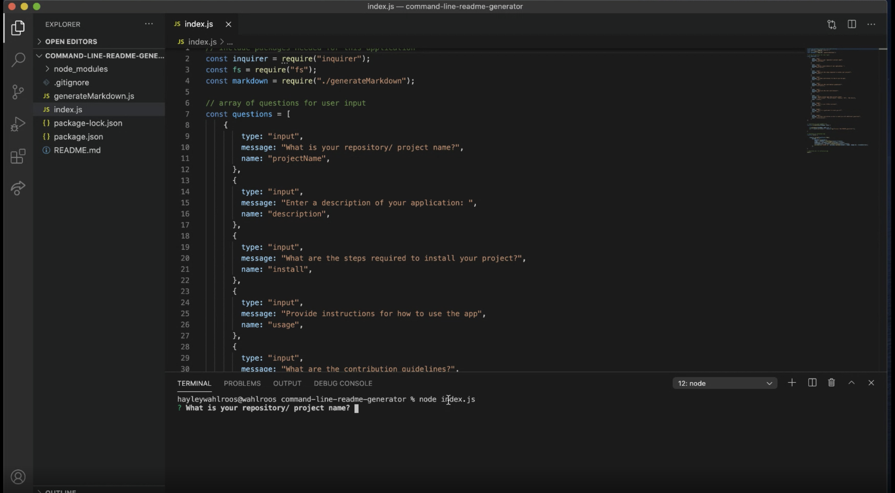
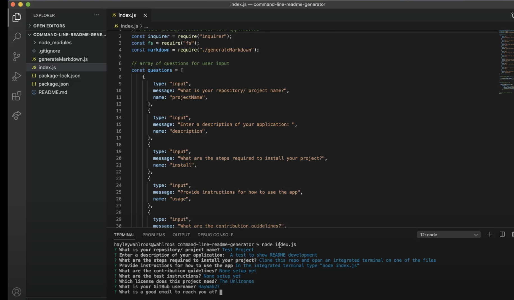
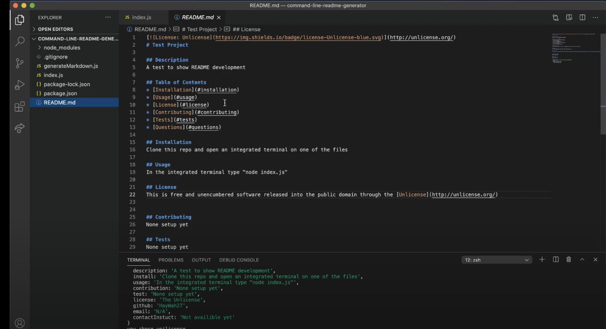

# Command Line README Generator

## Description
Using the command line in the integrated terminal, a user can quickly and easily create a README file. This is done using a JavaSCript file containing code for how to handle answers form the user. The questions asked are handled using the Inquirer JSON package. Node is used to invoke the relative JavaScript file. After the questions are answered, fs is used to write a new README.md file, in the repo folder, containing all the provided information.

## Table of Contents
* [Installation](#installation)
* [Usage](#usage)
* [License](#license)
* [Contributing](#contributing)
* [Tests](#tests)
* [Questions](#questions)

## Installation
Clone this repo and open an integrated terminal on any file from this repository (ex: index.js).

## Usage
A user needs to access the README questions by invoking the index.js file in an integrated terminal. Using an integrated terminal, input “node index.js” and follow the prompt messages.

### 1. Open integrated terminal 
### 2. Use input "node index.js" to invoke questions 
### 3. Follow prompts 
### 4. Open README.md file to see new file contents 

## License
This is free and unencumbered software released into the public domain through the [Unlicense](http://unlicense.org/)

## Contributing
Pull requests are the best way to propose changes to the codebase (we use [GitHub Flow](https://guides.github.com/introduction/flow/index.html)). We actively welcome your pull requests: 1. Fork the repo and create your branch from master. 2. If you've added code that should be tested, add tests. 3. If you've changed APIs, update the documentation. 4. Ensure the test suite passes. 5. Make sure your code lints. 6. Issue that pull request!

## Tests
No current tests available.

## Questions 
* Link to [GitHub](https://github.com/HayWah27)
* Email: N/A for now.
* Contact Instructions: 
  * Currently unavailable.